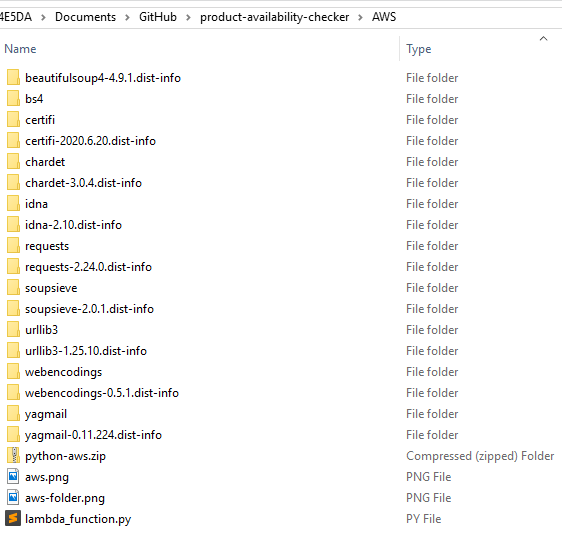
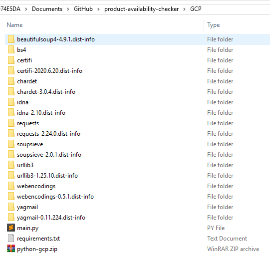

# Product Availability Checker

## Project Overview
Queries each website, checks product availability, and send an email if one of the products is available.  

Can be run locally, on **AWS Lambda**, on **GCP Cloud Functions**, or on **GitHub Actions**

## Components
- **Python 3.8**
  - various libraries: Beautiful Soup, Boto3, Requests, etc.
- **AWS**
  - Lambda
  - SES
  - EventBridge (CloudWatch Events)
- **GCP**
  - Cloud Functions
  - Cloud Source Repositories
  - Pub/Sub
  - Cloud Scheduler

## Usage
### AWS Instructions
- download the `python-aws.zip` file from the [AWS](/AWS) folder
#### Create a function
- **[AWS](https://console.aws.amazon.com)** > Lambda > Create function
- Author from scratch > Function name ... > Runtime: Python 3.8 > Permissions: Create a new role with basic Lambda permissions *
  * in IAM, attach SES access policy to the Role listed under Permissions
- Actions > upload a .zip file: `python-aws.zip` > Save
#### Test
- Test > Create new test event > Event template: hello-world > Event name ... > Create
- Test
#### Automate
- Designer > Add trigger > EventBridge > Rule: Create a new rule > Rule name ... > Rule type: Schedule expression > Schedule expression: `cron(0 13 * * ? *)` > Add  

### GCP Instructions - *** TO BE UPDATED ***
- download the `python-gcp.zip` file from [GCP](/GCP)
#### Create a function
- **[GCP](https://console.cloud.google.com)** > Cloud Functions > Create Function > Function name ... > Region ... > Trigger type:  Cloud Pub/Sub > Create a topic ... > Create Topic
- Save > Next
- Runtime > Python 3.8 > Source code > ZIP from Cloud Storage > Browse: `python-gcp.zip` > Deploy *
**OR**
- Runtime > Python 3.8 > Source code > Cloud Source repository > Branch > Branch name ... > Directory ... > Deploy *
  * in IAM, add *Cloud Functions Service Agent* and *Service Account User* Roles to the Member
#### Test
- Actions > Test function
#### Automate
- Cloud Scheduler > Create Job > Select a region: ... > Name ... > Frequency: `0 7 * * *` > Timezone ... > Target: Pub/Sub > Topic ... > Payload ... > Create

## Build
- create a new folder
- copy all the required Python packages from `C:\Users\USERNAME\AppData\Local\Programs\Python\Python38-32\Lib\site-packages` to this new folder

### AWS
- put the `lambda_function.py` file there
- archive all of the packages and the `lambda_functions.py` file into a **zip** file

### GCP - *** TO BE UPDATED ***
- put the `main.py` and the `requirements.txt` files there
- archive all of the packages, the `main.py` and the `requirements.txt` files into a **zip** file

## Features to add
- automate to run daily - **DONE** - using Windows Task Scheduler, AWS EventBridge, or GCP Cloud Scheduler
- email only if status =/= Out of Stock - **DONE**
- email only the products that are available
- run it on AWS Lambda - **DONE**
- link GitHub and AWS Lambda
- run it on GCP Functions - **DONE**
- add price - **DONE**
- run it with GitHub Actions - **DONE**
- add URL links in the text file
- use AWS SNS, SQS, or SES to send email instead of YagMail - **DONE** - using SES
- containerize it
- run new code in Lambda - **DONE**
- run new code in GCP (would need to provide AWS access key ID and secret access key)
- run new code in GitHub Actions (would need to provide AWS access key ID and secret access key)
- update documentation
- separate the URL list from the code

## Issues
- sends email even when all of the products are out of stock - **FIXED**
- only GCP email came, not AWS, GitHub, or when run locally (09.15.2020) - **FIXED** - one of the URLs became broken
- not sending email, code is running successfully, I think it's something with Gmail or Yagmail - **FIXED** - using AWS SES
  - tried: keyring, oauth, different gmail acct - no bueno
  - try EZGmail instead of Yagmail
