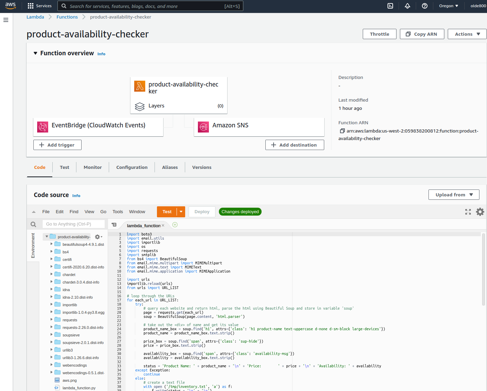

# Product Availability Checker

## Project Overview
Queries each website, checks product availability, and send an email if one of the products is available.  

Can be run **locally**, on **AWS Lambda**, on **GCP Cloud Functions**, or on **GitHub Actions**.

## Table of Contents
- **[Components](#components)**
- **[Usage](#usage)**
  - **[AWS](#aws-usage-instructions)**
  - **[GCP](#gcp-usage-instructions)**
  - **[GitHub](#github-usage-instructions)**
- **[Build](#Build)**
  - **[AWS](#aws-build-instructions)**
  - **[GCP](#gcp-build-instructions)**
- **[Possible Imrovements](#possible-improvements)**
- **[Issues](#issues)**
  

## Components
- **Python 3.8**
  - various libraries: Beautiful Soup, Boto3, Requests, Yagmail, etc.
- **AWS**
  - Lambda
  - SES
  - EventBridge (CloudWatch Events)
- **GCP**
  - Cloud Functions
  - Cloud Source Repositories
  - Pub/Sub
  - Cloud Scheduler
- **GitHub**
  - Actions

## Usage
### AWS Usage Instructions
- download the `python-aws.zip` file from the **[AWS](/AWS)** folder
#### Create a function
- **[AWS Console](https://console.aws.amazon.com)** > Lambda > Create function
- Author from scratch > Function name ... > Runtime: Python 3.8 > Permissions: Create a new role with basic Lambda permissions
  - in IAM, attach the `AmazonSESFullAccess` policy to the Role listed under Permissions
- Actions > upload a .zip file: `python-aws.zip` > Save
#### Test
- Test > Create new test event > Event template: hello-world > Event name ... > Create
- Test
#### Automate
- Designer > Add trigger > EventBridge > Rule: Create a new rule > Rule name ... > Rule type: Schedule expression > Schedule expression: `cron(0 13 * * ? *)` > Add  

### GCP Usage Instructions
- download the `python-gcp.zip` file from the **[GCP](/GCP)** folder
#### Sync Repos (Optional)
 - **[GCP Console](https://console.cloud.google.com)** > Cloud Source Repositories > Add repository > Connect external repository > Project: ... > Git provider: GitHub > ... > Connect selected repository
#### Create a function
- **[GCP Console](https://console.cloud.google.com)** > Cloud Functions > Create Function > Function name ... > Region ... > Trigger type:  Cloud Pub/Sub > Create a topic ... > Create Topic
- Save > Next
- Runtime: Python 3.8 > Source code `*`: Cloud Source repository > Repository: ... > Branch > Branch name ... > Directory ... > Deploy  
  `*` **OR** Source code: ZIP Upload > `python-gcp.zip` > Deploy  
  - in IAM, add *Cloud Functions Service Agent* and *Service Account User* Roles to the Member  
#### Test
- Actions > Test function > Test the function
#### Automate
- Cloud Scheduler > Create Job > Select a region: ... > Name ... > Frequency: `0 7 * * *` > Timezone ... > Target: Pub/Sub > Topic ... > Payload ... > Create
#### Update
- Edit > Next > Deploy

### GitHub Usage Instructions
- GitHub > Settings > Secrets >  
  - New secret > Name: `AWS_ACCESS_KEY_ID`, Value ... > Add secret  
  - New secret > Name: `AWS_SECRET_ACCESS_KEY`, Value ... > Add secret
- GitHub > Actions > New workflow > set up a workflow yourself > ...

#### Test
- Actions > Workflows: `product-availability-checker` > Re-run jobs

## Build
### AWS Build Instructions
- create a new folder
- copy all the required Python packages from `C:\Users\USERNAME\AppData\Local\Programs\Python\Python38-32\Lib\site-packages` to this new folder
- put the `lambda_function.py` file there
- archive all of the packages and the `lambda_functions.py` file into a **zip** file called `python-aws.zip`

### GCP Build Instructions
- create a new folder
- copy all the required Python packages from `C:\Users\USERNAME\AppData\Local\Programs\Python\Python38-32\Lib\site-packages` to this new folder
- put the `main.py` and the `requirements.txt` files there (`pip freeze > requirements.txt`)
- archive all of the packages, the `main.py` and the `requirements.txt` files into a **zip** file called `python-gcp.zip`
  - **zip** file is not required if syncing repos and using Cloud Source Repository as function source

## Possible Improvements
- [x] automate to run daily
- [x] email only if status =/= Out of Stock
- [ ] email only the products that are available or on backorder
- [x] run it on AWS Lambda
- [X] sync GitHub and AWS CodePipeline
- [x] sync GitHub and GCP Cloud Source Repositories
- [x] run it on GCP Functions
- [x] add price
- [x] run it with GitHub Actions
- [ ] insert info in the email body (instead of the attachment)
- [ ] hyperlink product webpage URLs to the product names
- [x] use AWS SNS, SQS, or SES to send email instead of YagMail (using SES)
- [ ] containerize it
- [x] run new code in Lambda
- [x] run new code in GCP
- [x] run new code in GitHub Actions
- [x] update documentation
- [ ] separate the URL list from the code

## Issues
- [x] sends email even when all of the products are out of stock
- [x] only GCP email came, not AWS, GitHub, or when run locally (09.15.2020)
  - one of the URLs became broken
- [x] not sending email, code is running successfully, I think it's something with Gmail or Yagmail
  - tried: keyring, oauth, different gmail acct - no bueno
  - try EZGmail instead of Yagmail
  - fixed by changing email to use AWS SES
- [x] GCP, GitHub, and local are not sending email as of 09.25.2020
  - all 3 started working again on 10.02.2020
- [x] AWS is also not sending email as of 09.30.2020
  - all 3 started working again on 10.02.2020
- [ ] GitHub is synced with the cloud repos but code/function re-deployment after a change is still a manual process
